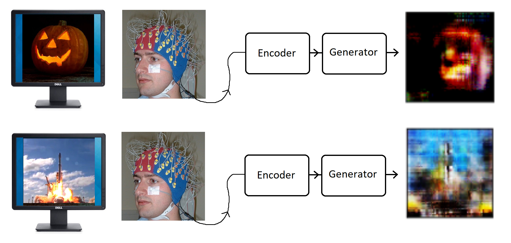
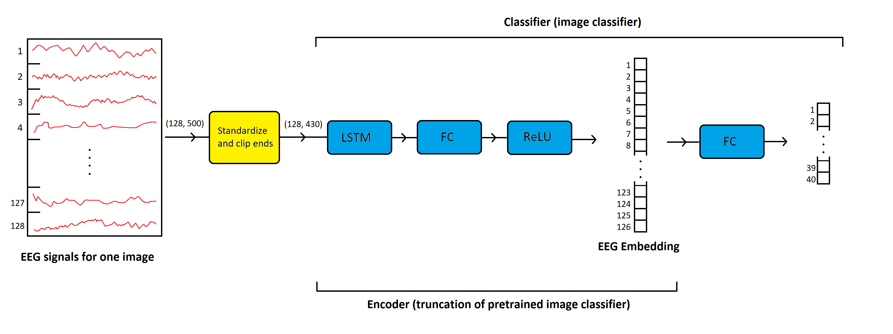
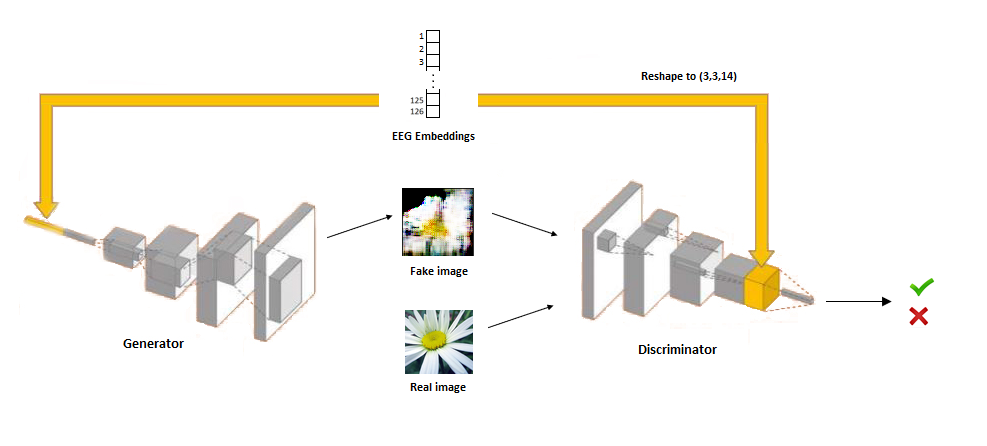
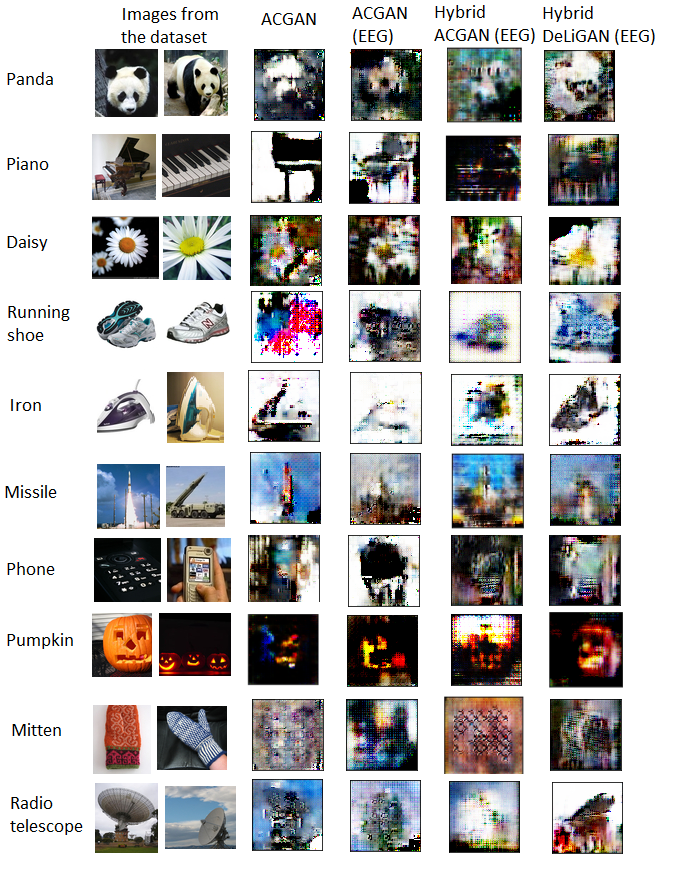

# Using EEG Signals to Condition Variants of GANs

MSc Computer Science thesis. The aim is to create a model capable of generating an approximation of images seen by an individual. To do this, EEG brain signals are measured and embedded using an LSTM. Then, these embeddings are used to condition variants of GANs, with the hypothesis that the embeddings may provide the GAN with more visual information. This research follows previous work by PeRCeiVe Lab.

## Summary

This project aims to look at how deep learning can be applied to mind reading. It also gives insight on:
1. How the EEG brain signal embeddings compare to one-hot encoding, when used to condition a GAN.
2. What architectures of GANs are best suited for this problem.

Figure 1. A visual representation of this project. The participant views a series of images and the EEG signals are encoded. These encodings are then used by the generator to attempt to predict the image seen.

## Encoder

The encoder seen in Figure 1 is a truncation of a pretrained model. This pretrained model was trained to classify 40 different image classes, using the EEG data. This is shown below in Figure 2. See that the encoder outputs a 126-length embedding of the EEG. The embedding length of 126  was chosen so we can reshape the embedding to the square cuboid shape of (3,3,14).

Figure 2. A visual representation of the classifier and how it is truncated to give the encoder.

 

**Result:** we now have an encoder which reduces the dimensionality (128x500) of the EEG down to a 126-length embedding. We hypothesize that these embeddings may contain both visually-relevant and class-discriminative information extracted from the input signals.

## Generator

#### GAN Explanation
A typical GAN is made up of the generator model and the disciminator model. The aim of the generator is to generate fake data mimicking the real dataset (usually consisting of images). The aim of the discriminator is to classify the generated data as being from the real dataset or the fake dataset. The generator learns to trick the discriminator into wrongly classifying the fake dataset. If the adversarial process is successful, the generator can generate fake images indistinguishable from real images. 

#### Conditional GAN Explanation
It becomes very challenging for GANs to generate images that are from different classes. To solve this, the generator and discriminator of the conditional GAN (CGAN) receive information about the class of the image. Often the information is a one-hot encoding of the image class. This allows the generator to learn to generate images of the correct class. Below in Figure 3 we see how the EEG embedding is used in a CGAN.

Figure 3. A conditional GAN (CGAN) using convolutional layers in the discriminator and transposed convolutional layers in the generator. The EEG embedding is appended to the latent space of the generator and to the penultimate output of the discriminator.

## Results

In Figure 4 we see the results. We look at 10 classes of the images. The GAN architectures (e.g. ACGAN) are explained in the next section. On the left we have two sample images from the dataset. Then we have the results from the ACGAN conditioned on a one-hot encoding of the classes. The remaining GAN architectures use the EEG embeddings as conditioning.

Figure 3. Final results of our project. GAN architectures are explained in the following section.

## GAN Architecures

Find the code for these in ???????

#### ACGAN

## Method and Code

In this section I explain the method used and relate this to the code in the repository. 

#### Embedding the EEG

Code for this is found in the embed_the_eeg notebook. In this notebook the RNN classifier is trained to use the EEG data to predict what class of image the user was observing at the time. Then this RNN classifier is truncated to output the 126-length pernultimate output. This output is the embedding. These embeddings are then averaged for each class. It was found that using the embedding for each image as conditioning did not work. This code is based on the code provided by PeRCeiVe Lab. Note that this is the only code provided to me.

#### Build the Full Dataset

Code for this is found in the creating_full_dataset notebook. In this notebook the images are converted into 64x64x3 numpy arrays. Then the images, EEG embeddings and labels (one-hot encoded) are brought together into one dataset. This dataset is then shuffled and saved.

#### Building a Classifier

One of the architectures (Hybrid ACGAN) uses a pretrained classifier in the architecture. This is pre-trained to classify the 20 images classes. The notebook image_classifier trains this model and saves it. 

#### Training the GAN

In the notebook training_gans, we have the code to train the GANs. This notebook shows the DeLiGAN hybrid DeLiGAN being trained. The DeLiGAN involves a mixure model which reparameterizes the latent space (space in which the noise is generated). This is a layer I have defined in the notebook as DeLiGANLayer. We then have three functions which build the Keras GAN models. One for the discriminator, one for the generator and one for the GAN (combining the previous two). After this we have a train function and some functions to help display outputs of the GAN, as it is trained. 

