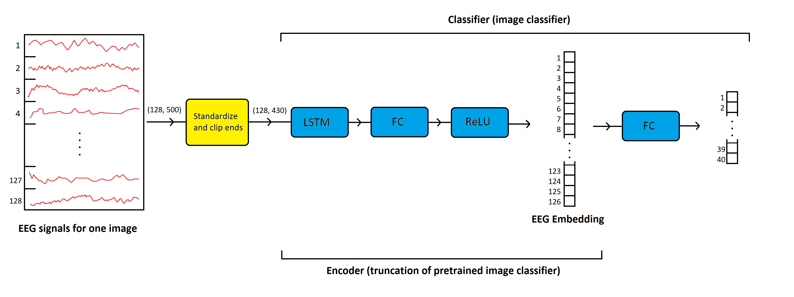

# Using EEG Signals to Condition Variants of GANs

MSc Computer Science thesis. The aim is to create a model capable of generating an approximation of the images seen by people. I attempt to replicate previous work (PeRCeiVe Lab) to condition variants of GANs with EEG brain signals. 

## Summary

This project aims to look at how deep learning can be applied to mind reading. It also gives insight on:
1. How the EEG brain signal embeddings compare to one-hot encoding, when used to condition a GAN.
2. What architectures of GANs are best suited for this problem.

Figure 1. A visual representation of this project. The participant views a series of images and the EEG signals are encoded. These encodings are then used by the generator to attempt to predict the image seen.

## Encoder

The encoder seen in Figure 1 is a truncation of a pretrained model. This pretrained model was trained to classify 40 different image classes, using the EEG data. This is shown below in Figure 2. See that the encoder outputs a 126-length embedding of the EEG. The embedding length of 126  was chosen so we can reshape the embedding to the square cuboid shape of (3,3,14).

Figure 1. A visual representation of the classifier and how it is truncated to give the encoder.

 

**Result:** we now have an encoder which reduces the dimensionality of the EEG (on 128 channels) down to a 126-lenth embedding. We theorize that these embeddings may contain both visually-relevant and class-discriminative information extracted from the input signals.
