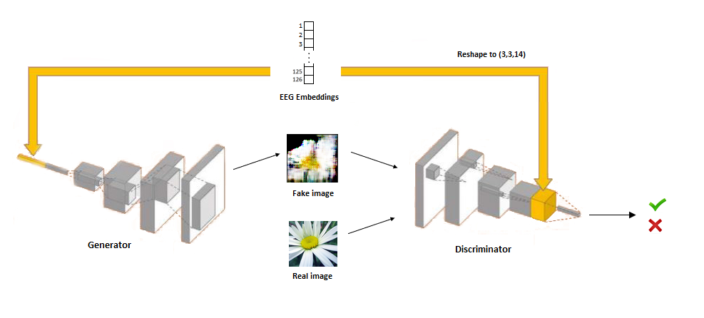
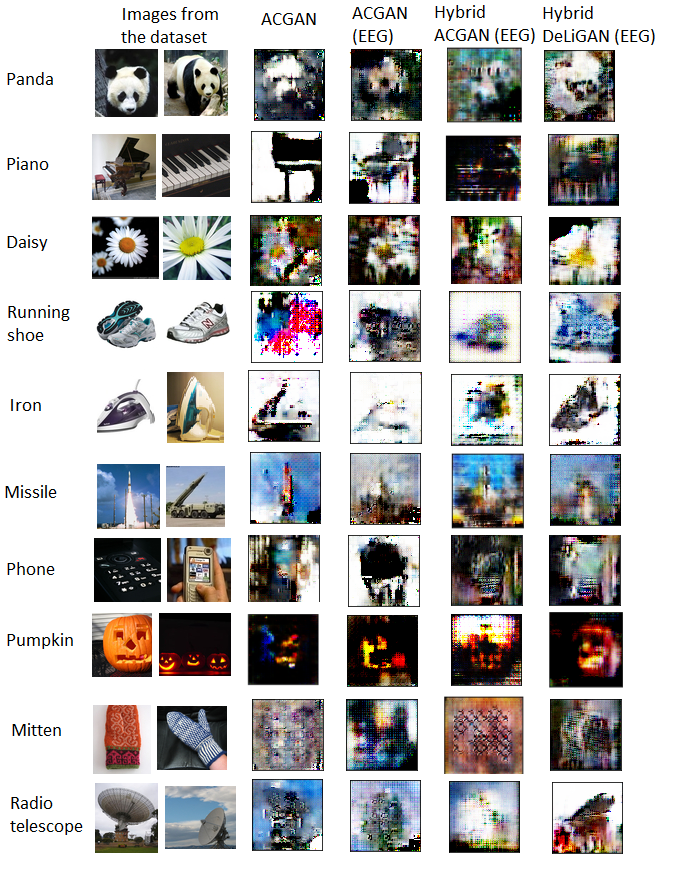

# Using EEG Signals to Condition Variants of GANs

MSc Computer Science thesis. The aim is to create a model capable of generating an approximation of images seen by people. I attempt to replicate previous work (PeRCeiVe Lab) to condition variants of GANs with EEG brain signals. 

## Summary

This project aims to look at how deep learning can be applied to mind reading. It also gives insight on:
1. How the EEG brain signal embeddings compare to one-hot encoding, when used to condition a GAN.
2. What architectures of GANs are best suited for this problem.

Figure 1. A visual representation of this project. The participant views a series of images and the EEG signals are encoded. These encodings are then used by the generator to attempt to predict the image seen.

## Encoder

The encoder seen in Figure 1 is a truncation of a pretrained model. This pretrained model was trained to classify 40 different image classes, using the EEG data. This is shown below in Figure 2. See that the encoder outputs a 126-length embedding of the EEG. The embedding length of 126  was chosen so we can reshape the embedding to the square cuboid shape of (3,3,14).

Figure 2. A visual representation of the classifier and how it is truncated to give the encoder.

 

**Result:** we now have an encoder which reduces the dimensionality of the EEG (on 128 channels) down to a 126-length embedding. We theorize that these embeddings may contain both visually-relevant and class-discriminative information extracted from the input signals.

## Generator

<ins> GAN Explanation </ins>  
A typical GAN is made up of the generator model and the disciminator model. The aim of the generator is to generate data mimicking the dataset. The aim of the discriminator is to classify the generated data as being from the real dataset or the fake dataset. The generator learns to trick the discriminator into wrongly classifying the fake dataset. If the adversarial process is successful, the generator can generate fake images indistinguishable from real images. 

<ins> Conditional GAN Explanation </ins>  
It becomes very challenging for GANs to generate images that are from different classes. To solve this, the generator and discriminator of the conditional GAN (CGAN) receive information about the class of the image. Often the information is a one-hot encoding of the image class. This allows the generator to learn to generate images of the correct class. Below in Figure 3 we see how the EEG embedding is used in a CGAN.

Figure 3. A conditional GAN (CGAN) using convolutional layers in the discriminator and transposed convolutional layers in the generator. The EEG embedding is appended to the latent space of the generator and to the penultimate output of the discriminator.

## Results

In Figure 4 we see the results. We look at 10 classes of the images. The GAN architectures (e.g. ACGAN) are explained in the next section. On the left we have two sample images from the dataset. Then we have the results from the ACGAN conditioned on a one-hot encoding of the classes. The remaining GAN architectures use the EEG embeddings as conditioning.

Figure 3. Final results of our project. GAN architectures are explained in the following section.

 might be pics in my memory stick

## GAN Architecures

Find these in the gan_models.py.

## Method

In this section I explain the method used and relate this to the code in the repository. 

### Training the EEG Classifier

### Extracting the EEG embeddings

### Build the Image Dataset

### Build the Full Dataset

### Training the GAN

